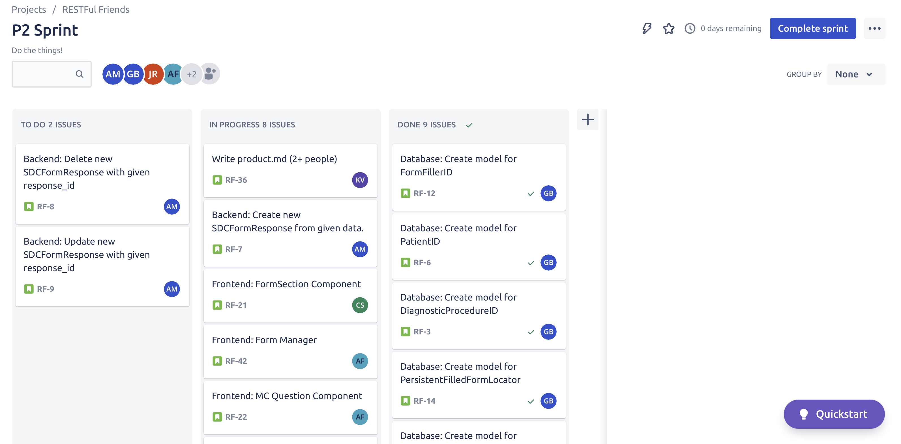
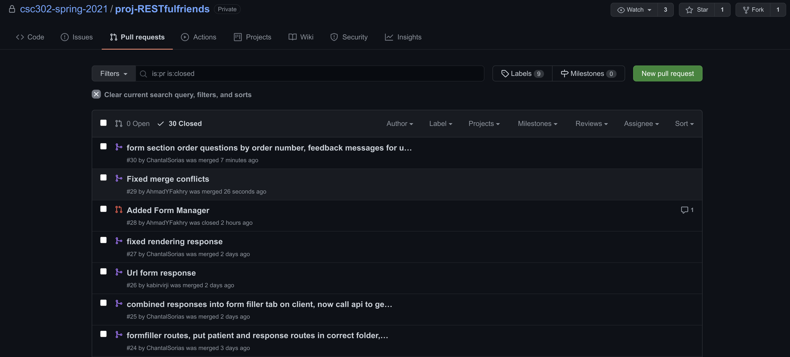

# What did you actually build during this phase?

One of the most important things we built during this phase was our database. We created MongoDB models for Patient, FormFiller, SDCForm, and SDCFormResponse. We finalized our database schemas, and that helped guide the project, since we knew what relevant information needs to be passed through the application into our database. All of our models are organized in the models folder under server. In terms of the backend, we finished our CRUD methods and API routes for each model. Each route interacts with our database, using requests such as `GET`, `POST`, and `PUT`. Our routes can be viewed in `server/routes`. 

Our frontend is much more fleshed out than it was for P1. We built an interface that allows for the uploading of medical procedure reports and medical form responses in the format of SDC forms. Once uploaded, users can view, update, and delete these forms and responses through our user interface. We split our interface into different parts. The Home Page, Navbar, Response, Form Manager, and Form Filler. Each part is responsible for part of the user flow. The Home Page is what the user sees upon opening our application, and the Navbar is at the top of the page for navigation between components. The Response component deals with FormResponses. When a Form is filled out, the user is redirected to the Response component via a unique URL with the Form ID. The Form Manager is responsible for uploading the interface page, updating the SDCForm, and deleting the SDCForm. The Form Filler, is responsible for the CRUD of SDCFormResponses, and creating Form Fillers and Patients. 

 

# How is this different from what you originally proposed? Why?

Many of our ideas didn’t change, however some implementation did. For example, we proposed to split up the questions into multiple different components, however we realized we could have a general “multiple choice” component to cover many kinds of form questions. 

 

# High-level design of your software.

Our platform is naturally split into the standard three sections of Frontend, Backend, and Database. We are using the MERN (MongoDB, Express, React, Node) stack. For our database, we are using MongoDB which is a NoSQL database program used to store JSON-like documents. The backend uses Express and Node to read, create, update, and delete these documents. For the frontend, we use React to render our user interface. It makes api calls to the backend to perform the different user tasks.

Technical highlights: interesting bugs, challenges, lessons learned, observations, etc.

Being able to upload an XML form was challenging. Figuring out the process of doing it, front end, ended up going with drag and drop. Form manager. 

Trying to make sure the UI makes sense - can’t have another drag and drop. 

Parsing the XML was a lot of work with a lot of edge cases; first from the actual SDC documents themselves (having to read through all the technical documentation to understand everything that was included) to then having to map that information to the JSON that came from directly converting the XML. Throughout the process of creating the XML parser, I had to continually update our original database models since some of the original ideas we had come up with were either not possible, missing key components, or would require far too complex a solution to get working with how the actual XML forms were structured.

Maintaining a NoSQL DB required a lot of roundabout solutions, at least for maintaining the SDCForms and dependencies; mainly due to the unknown amounts of nested children that our models could potentially have. The solutions that I eventually settled on was, in essence, custom middleware. If I had to redo the project I would probably go with a relational database design next time.

 

# Reflect on your teamwork and process. What worked well, what needs improvement.

While working on this project, we were constantly struggling with maintaining a constant stream of communication between team members. As such, we tried to implement different tools and scheduling plans to amend this, with varying degrees of success. 

Firstly, we decided to implement the project management tool, Jira. This allowed us to create different work tasks and assign them to different people. We would then be able to assign these tasks to different sprints and split them into three sections: To Do, In Progress, and Done. All tasks will start in To Do, and any user can move these tasks whenever they make progress. Ideally, we wanted to only move tasks to In Progress when they were being actively worked on. We also decided that we should try and finish our current task before starting a new one, although we knew there would be exceptions. Finally, whenever a user moves a task, every other team member receives an email notification. This aids in team motivation and can remind team members about what other work they may have to complete for the sprint.

 

 

Another tool we used to improve our workflow was github pull requests. We required every merge of main to be made in the form of a pull request. This allowed us to make sure that every merge was of the highest quality. When a pull request is made, every team member is notified via email. We then require a team member to read the details of the request before either rejecting it with a comment, or approving it and allowing the merge to go forward. This was a very effective method to ensure our main branch was always at its best.

 

 

In terms of scheduling plans, we decided that we would meet every monday at 3pm to update the team on the progress that everyone had made up to that point, as well as any new tasks that we would need to address. This had its usefulness, mostly in terms of keeping the team in contact at least once a week, but as time went on and our workloads from other classes increased, it was harder to get everyone together at one time. As such, we would have to update the missing members by text after every meeting; with varying levels of responsiveness.

 

# Triage: What will you build for phase 3, the final demo?

As the final product of our P2 is mostly focused on functionality, we will be spending the majority of P3, creating tests and a polished and visually appealing user interface. Since we are using material ui, this would mostly involve creating our own custom themes and layouts, using the libraries’ theme provider tools. We would also want to create our own custom assets, including logos and favicons, to help enhance the UI.

Frontend will not be the only thing we will be improving however. We would also want to add more backend functionality. This would include the implementation of many new features such as, finding saved SDCFormResponse by querying by DiagnosticProcedureID and/or date, creating default answers to SDCFormResponse, allowing form managers to replace/update SDCForms, and the emailing of a form receiver upon form completion.

Finally, we would like to more rigorously test our code to make sure it functions as intended, even in edge cases. This may mean that we have to adjust some of our existing code, so we would also focus on addressing any and all problems that show up from testing.
